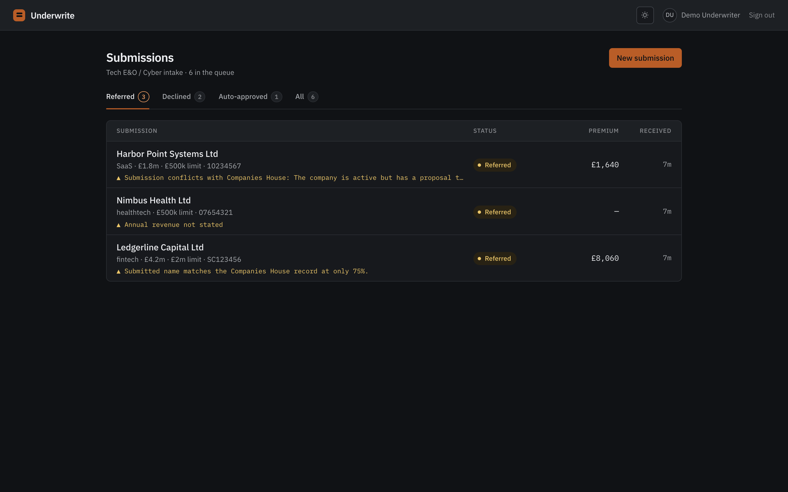
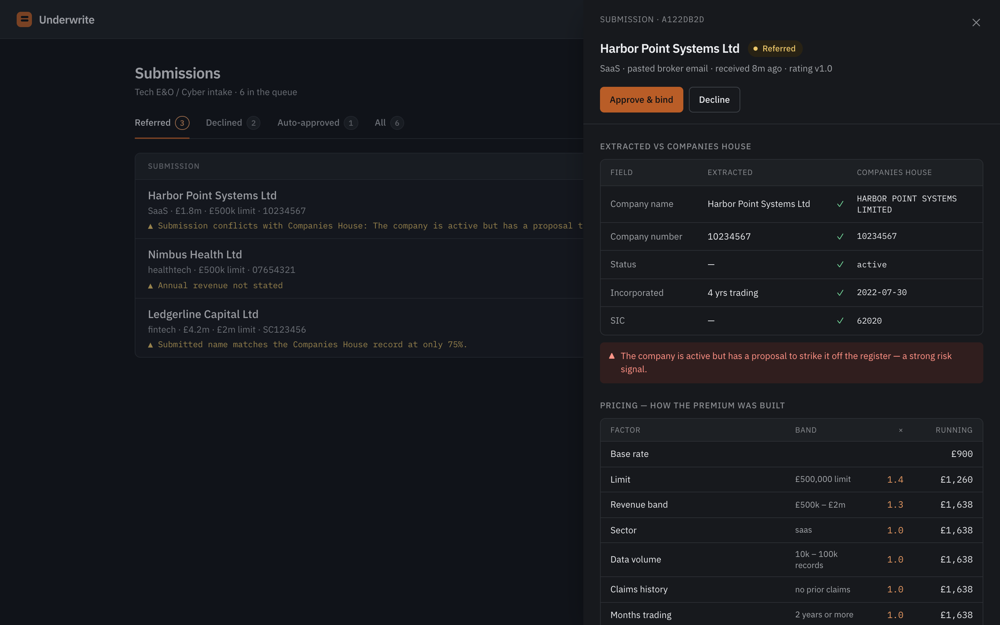
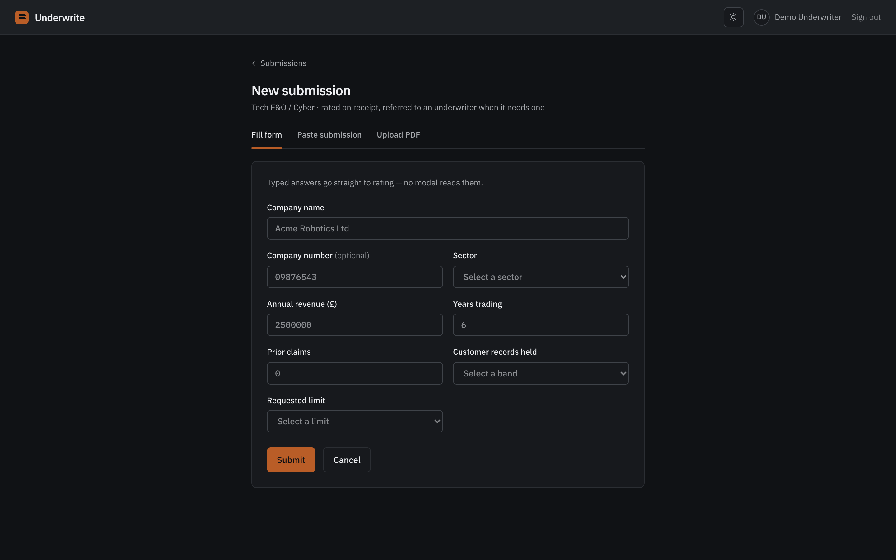
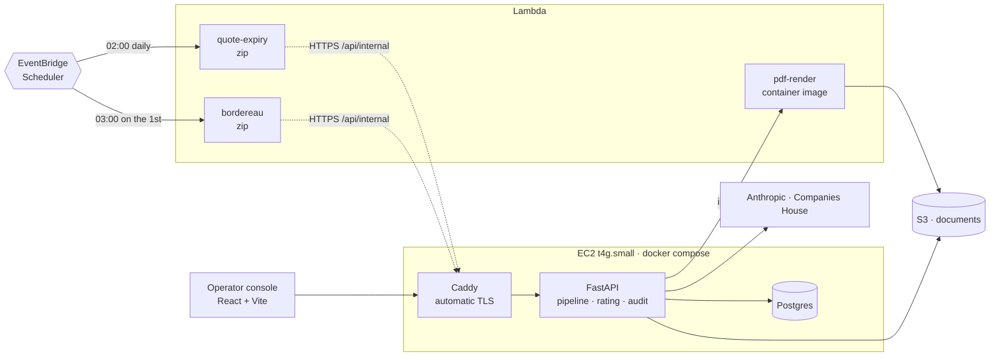

# Underwrite — AI Underwriting Workbench

A submission-to-quote pipeline for **Technology E&O / Cyber** insurance. A broker sends in a risk;
Underwrite turns it into a priced, reviewable quote in seconds — an LLM reads the submission, the
company is verified against Companies House, a deterministic engine prices it, and an operator
approves or declines from a console that shows exactly how every number was reached.

## What it does

Insurance intake is unstructured — a broker pastes an email, fills a form, or attaches a PDF.
Underwrite ingests that and runs it through a fixed pipeline:

```
submission ──▶ extract ──▶ enrich ──▶ rate ──▶ operator decision ──▶ quote PDF
              (LLM)      (Companies    (rules      (approve /          (Lambda →
                          House)        engine)     decline)            S3)
```

- **Extract** — `claude-sonnet-5` parses the raw submission into a validated `ExtractedApplication`
  (structured outputs, no free-text scraping). Missing fields are recorded, not guessed.
- **Enrich** — the company is looked up at Companies House; the submitted name/number/status are
  reconciled and discrepancies (name mismatch, strike-off, dissolved) are flagged.
- **Rate** — a **pure, deterministic** engine prices the risk from table-driven factors (limit,
  revenue band, sector, data volume, claims, trading history). It emits an auditable factor trace
  that folds back to the premium, plus a decision: **auto-approve**, **refer** to a human, or
  **decline**.
- **Decide** — an operator reviews referrals in the console (extracted-vs-Companies-House
  side-by-side, the premium build-up, the reasons) and approves or declines. Every action is
  written to an append-only audit trail that names the underwriter.
- **Quote** — an approved submission renders a specimen quote PDF (WeasyPrint in a Lambda) stored
  in S3 and served via a presigned URL.

**The core design principle:** the LLM only ever *parses* (probabilistic, so anything uncertain is
referred to a human); the engine *prices* (deterministic, table-driven, and asserted
character-for-character against `docs/RATING_SPEC.md`). Nothing an LLM says sets a price.

## The console

Six seeded submissions, filtered by outcome. Each row carries the one line an underwriter needs to
decide whether to open it — the reason it was referred, not a status chip.



Opening a referral shows the whole case: what the broker submitted against what Companies House
says, field by field; the risk signal that caused the referral; and the premium built one factor at
a time, each row a band and a multiplier, folding to the number at the bottom. There is no step in
that ladder the operator has to take on trust.



Intake takes three shapes — a typed form, a pasted broker email, an uploaded PDF. Only the last two
reach a model; typed answers go straight to rating, because there is nothing to parse.



Everything above runs from `make up && make seed`, with no AWS account and no API keys.

## Architecture & stack

Three tiers, same-origin in dev via a Vite proxy:

**Backend** (`api/`) — **FastAPI** (async, `lifespan`), **SQLAlchemy 2 async** + **asyncpg** on
**Postgres**, migrations via **Alembic**. Money is integer **pence** end to end; rate factors are
`Decimal`. Domain enums/value-objects (`app/domain/`) import only stdlib; the rating engine
(`app/services/rating.py`) is import-pure and AST-tested for it. External calls — **Anthropic**
(extraction), **Companies House** (enrichment, fuzzy-matched with **rapidfuzz**) — go through
`httpx` and are `respx`-mocked in tests. PDF rendering is **WeasyPrint**, kept out of the API image
and run as a **Lambda** (the API only builds the HTML). ~485 tests, property-based invariants
(**Hypothesis**) + golden files on the engine.

**Frontend** (`web/`) — **React** + **TypeScript** + **Vite**, **Tailwind v4**, **TanStack Query**,
typed against the API's OpenAPI schema (`openapi-fetch`, `openapi-typescript`). The operator console:
a status-filtered queue, a detail drawer (comparison, factor ladder, timeline, quote), and the
approve/decline actions. Design tokens are authoritative (`DESIGN.md`, `PRODUCT.md`) — light/dark is
a pure CSS-var swap.

**Infra** (`infra/`, `deploy/`, `lambdas/`) — **Terraform** on AWS: a single **EC2** box running
`docker compose` under a `systemd` unit, **Caddy** fronting the API with automatic TLS, **Postgres**
on the container network, **S3** for documents, and **three Lambdas** — one arm64 container image
for PDF rendering, and two dependency-free zips driven by **EventBridge Scheduler**. Images are
tagged by git SHA in **ECR** (immutable, never `latest`). **CD** (`cd.yml`) federates AWS via
**GitHub OIDC** — no static keys — building on every merge to `main` with a gated deploy. Deploy
tickets follow **apply → verify → destroy**: nothing runs between verifications, so the idle bill is
≈ $0.



**Read the dashed arrows.** The scheduled Lambdas point back at the *API*, not at Postgres. The
database has no published port — which is what makes it free (no RDS, no VPC connector, no NAT
gateway) and is equally what puts it out of Lambda's reach. So those two hold the schedule, the
retry and the alarm, and the work runs where the data is. Reaching the database directly would cost
a VPC attachment plus a NAT gateway, roughly twice the box, to save an HTTPS call. See D-031.

## Repository layout

| Path | What's there |
|---|---|
| `api/` | FastAPI app — `app/api/routes`, `app/services` (extraction, enrichment, rating, quote, pdf), `app/models`, `app/domain`, `app/schemas`; `tests/` |
| `web/` | React operator console (Vite + Tailwind) |
| `infra/` | Terraform (EC2, S3, Lambda, IAM, ECR, OIDC, budgets) |
| `lambdas/pdf_render/` | WeasyPrint container Lambda (HTML → PDF → S3) |
| `lambdas/quote_expiry/` | Daily sweeper — one stdlib file, no dependencies |
| `lambdas/bordereau/` | Monthly carrier export — one stdlib file, no dependencies |
| `deploy/` | prod compose, Caddyfile, systemd unit |
| `docs/` | `RATING_SPEC.md` (authoritative pricing) + `DECISIONS.md` (committed rationale) |

## Local development

A clone, Docker, and `make` are the whole prerequisite list — no AWS account, no API keys, no
Python or Node on the host:

```
git clone <this repo> && cd Underwrite
make up        # writes .env from .env.example, builds, migrates, waits for health
make seed      # six sample submissions — one auto-approved, three referred, two declined
make demo      # runs a submission end to end and writes a quote PDF
```

Then `http://localhost:5173`, login `demo` / `underwrite-demo`. The two optional keys buy exactly
what you'd expect and nothing else: without `ANTHROPIC_API_KEY` the paste and PDF intake modes are
unavailable (the typed form never touches a model), and without `COMPANIES_HOUSE_API_KEY` every
submission refers with `CH_UNAVAILABLE` instead of a verified register comparison — deliberately,
because "we could not ask" is not "the register said no". Rating, the console, the audit trail and
the quote PDF need neither.

```
make test      # pytest, containerised
make lint fmt  # ruff
```

Postgres is on host port **55432**; the API on **8000**.

## Operator console

`make up` also starts a Vite dev server (containerised) at **http://localhost:5173** that proxies
`/api` to the API — same-origin, so there is no CORS. Every data and money-spending route sits
behind a login; only `/health` and `/api/auth/login` are open.

```
make up && make seed        # seeds the sample submissions + a demo operator
make web-types              # regenerate web/src/api/schema.d.ts from the live OpenAPI
make web-lint               # eslint + tsc
```

**Local login:** `demo` / `underwrite-demo` (set by `SEED_OPERATOR_*`, overridable in `.env`). The
**deployed URL uses a strong, private password** from `.env.prod` — never this public default, and
never committed. Auth is a signed-cookie session (Argon2id hashes); rotating `SECRET_KEY` logs
everyone out. See `docs/DECISIONS.md` D-026.

## LLM extraction

Pasted submissions are parsed into a validated `ExtractedApplication` by
`app/services/extraction.py` (`claude-sonnet-5`, structured outputs). `make test` excludes the
live-LLM tests; run them against the real API with `make test-llm` (set `ANTHROPIC_API_KEY` in
`.env` first — this spends). If the rambling-email case underperforms, escalate with
`EXTRACTION_MODEL=claude-opus-5` in `.env` — that's the lever, not a prompt rewrite. Opus 5 is
the same $5/$25 per MTok as Opus 4.8 and strictly more capable, so there is no reason to pin the
older one.

**`extraction_confidence` is LLM self-reported and weakly calibrated** — a legitimate signal to
refer a risk for human review, not a statistical error rate. Treat a low value as "look at this",
not "this is X% likely wrong".

## Production image & deploy

The API runs from a multi-stage image (`api/Dockerfile`) that carries no build tooling and no
WeasyPrint dependencies — PDF rendering is a separate Lambda. Images are tagged by git SHA and
pushed to an immutable ECR repo; deploys pin to a SHA and never a moving `latest`.

```
make prod-up               # run docker-compose.prod.yml locally (build + health check)
make push-api              # arm64 build + push to ECR, tag = git sha
make deploy image=<ref>    # SSM the box to pull the tag and restart the unit
```

On the box: `docker compose` under a `systemd` unit (`deploy/underwrite.service`), Caddy fronting
the API on 80/443, Postgres on the container network only. `user_data` provisions Docker, the
compose plugin, and the ECR credential helper, and clones this repo for the deploy manifests; the
app always runs from the ECR image. Secrets live in `/opt/underwrite/.env` (chmod 600). See
`docs/DECISIONS.md` D-016.

### PDF render Lambda (staged apply)

The renderer is a container-image Lambda (`lambdas/pdf_render/`). `aws_lambda_function` can't apply
until its image exists in ECR, so deployment is **staged, with the image tag as a Terraform
variable**:

```
terraform apply -target=aws_ecr_repository.pdf_render   # once; the repo (done at #14)
make push-pdf-lambda                                    # buildx arm64, tag = git sha, push
make tf-apply … -var image_tag=$(git rev-parse --short HEAD)
```

The function is gated `count = var.image_tag != "" ? 1 : 0`, so a box-only apply needs no image;
passing `-var image_tag=<sha>` creates it. Verify with `aws lambda invoke` — it writes a PDF to
`s3://…/generated/`.

Why this over the alternatives:
- **`null_resource` + `local-exec`** to `docker push` inside `apply` couples Terraform to a Docker
  daemon and hides the build in state — the push isn't a tracked resource and reruns are murky.
- **A dummy `:bootstrap` image + `lifecycle { ignore_changes = [image_uri] }`** lets the first
  apply succeed, but then Terraform never tracks the tag again, so deploys drift outside state.

An explicit `image_tag` var keeps the image a build artifact and the deploy a plain, reviewable
`apply` pinned to a commit.

### Scheduled jobs (expiry sweep, bordereau export)

Two zip Lambdas, each **one stdlib file with no dependencies** — `archive_file` packages them at
plan time, and `python3 handler.py` runs either one anywhere, which is what the local targets do:

```
make expiry-lambda-test                      # sweep expired quotes against the local stack
make bordereau-lambda-test PERIOD=2026-06    # export a month; omit PERIOD for the one just closed
```

Neither touches the database. Both `POST` to `/api/internal/…`, which is gated by `SWEEPER_TOKEN`
(compared with `secrets.compare_digest`; **unset means 503, not 401**, so an unconfigured deployment
is closed rather than open).

The token lives in the box's `.env` and in **SSM Parameter Store**, which the Lambdas read at
runtime. **Terraform is given the parameter's name, never its value** — an `aws_ssm_parameter`
resource, a `data` source, or a `sensitive` variable all write the secret to the state bucket in
plaintext, so any of them would have looked like a fix and changed nothing. Create it once, by
hand, then pass the name:

```
aws ssm put-parameter --name /underwrite/sweeper-token --type SecureString --value "$TOKEN"
make tf-apply … -var sweeper_token_param=/underwrite/sweeper-token
```

Locally there is no SSM: `SWEEPER_TOKEN` in the environment short-circuits the lookup, which is why
`python3 handler.py` still runs anywhere. See D-034.

| Job | Schedule | What it does |
|---|---|---|
| `quote-expiry` | `cron(0 2 * * ? *)` Europe/London | Marks quotes past `valid_until` as expired, one `quote_expired` audit event each. Idempotent: repeat runs select nothing. |
| `bordereau` | `cron(0 3 1 * ? *)` Europe/London | Writes `s3://…/bordereaux/YYYY-MM.csv` for the month that just closed, one `bordereau_exported` event per submission. |

**Schedules are off by default** (`-var enable_schedules=true` to create them). They outlive a
targeted destroy, and one pointing at a released EIP fails every night for nothing.

Two things that cost real time here, both in D-032/D-033:

- **A month is `Europe/London`, not UTC.** BST puts the first hour of every summer month on the
  previous UTC day, so UTC bounds misfile every quote issued in that hour. The API picks the period
  (`/bordereaux/latest`) precisely so no caller has to get this right.
- **`aws:SourceArn` is the schedule *group* ARN**, never the schedule's. Scoping to the schedule
  matches the resource but nothing that is ever checked, and 400s every create; scoping to `default`
  then lets any schedule in the account assume the role. Hence a group of the project's own.

### CD (GitHub Actions)

`cd.yml` federates AWS via OIDC — no static keys. Build-and-push runs on every merge to `main`;
rollout is a manual `workflow_dispatch`. Set these repo **variables** (Settings → Actions):

- `AWS_ROLE_ARN` — `terraform output github_actions_role_arn`
- `ECR_API_REPO` — `terraform output api_ecr_repository_url`

## Design decisions

The choices worth defending, each with the reasoning committed in `docs/DECISIONS.md`.

**The LLM parses; it never prices.** Extraction is probabilistic, so its output is validated into a
typed schema, its missing fields are recorded rather than guessed, and anything uncertain refers to
a human. Pricing is a pure function over versioned tables, asserted character-for-character against
`docs/RATING_SPEC.md`. Nothing a model says moves a premium. *(D-021)*

**Every decision is audited, and the machine is an actor too.** The trail is append-only at the
database — an `AuditEvent` cannot be updated or deleted, enforced by triggers rather than
convention. System actions carry `actor='system'` with **no** `actor_id`: borrowing a human's
identity for a scheduled sweep would falsify the record an auditor reads. *(D-007, D-010, D-031)*

**Degrading gracefully is a decision, not a fallback.** When Companies House is unreachable the
submission still prices and refers with a distinct `CH_UNAVAILABLE` code — because "we could not
ask" and "the register said no" are different facts, and collapsing them makes a dead API key
indistinguishable from an empty register. *(D-029)*

**Why each Lambda is a Lambda — and why three things are not.** PDF rendering is bursty and
CPU-spiky and drags ~50MB of WeasyPrint dependencies, so it is a container-image Lambda and the API
only builds HTML. The expiry sweep and the bordereau export are periodic, latency-insensitive batch
work, so they are scheduled zips. But rating stays inline (a pure function; a network hop adds
latency and a failure mode for nothing), extraction stays inline (~3s inside a synchronous request,
where a cold start buys nothing), and enrichment stays inline (~1s, already degrades gracefully).
**And the two scheduled Lambdas turned out to hold schedules, not work** — the database is
deliberately unreachable from Lambda, so they call the API instead. That constraint is the most
honest thing in this repo's architecture. *(R1, D-031, D-032, D-033)*

**Presigned URL lifetime is bounded by the credential, not the parameter.** Signing is local — no
API call, no `s3:PresignObject` — so a URL is valid for `min(ExpiresIn, remaining credential life)`.
Instance-profile credentials rotate on a ~6-hour ceiling, so a 7-day `ExpiresIn` silently yields a
URL that 403s within hours. They are generated per request at 900s and never stored. *(R3)*

**`extraction_confidence` is self-reported, not calibrated.** It is a model's own opinion of its
work, useful as a trigger for human review and worthless as an error rate. Treat a low value as
"look at this", never as "this is X% likely wrong". *(R8)*

**Money is integer pence, end to end.** `Decimal` for rate factors, built from string literals;
no `float` ever touches the money path; rounding happens once, at the end. The bordereau CSV is the
only place pounds appear, derived by `divmod` so the rule survives to the file. *(D-032)*
